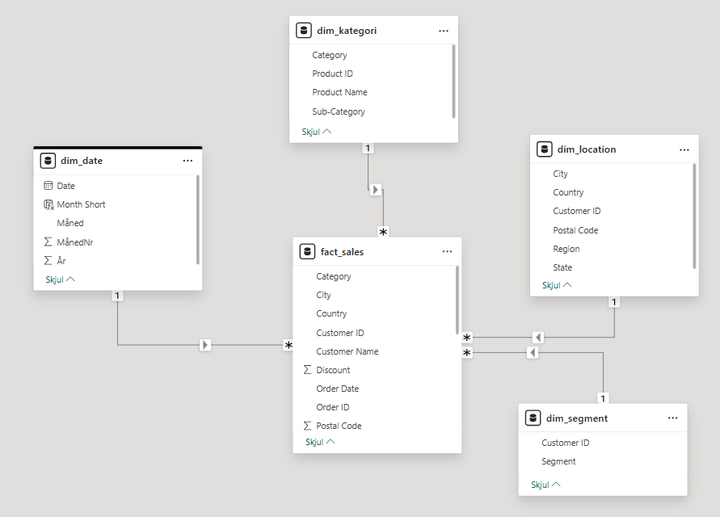
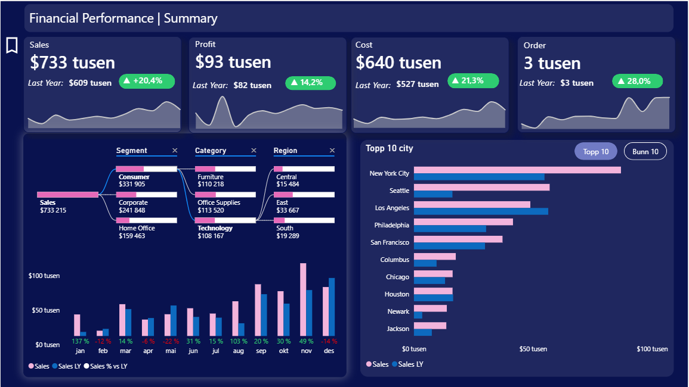

I dette prosjektet utviklet jeg en helhetlig Power BI-rapport for å analysere omsetning, lønnsomhet og drivere bak marginutvikling. Gjennom strukturert KPI-design, DAX-beregninger og interaktiv drilldown identifiserte jeg hvordan fraktstrategi og rabatter påvirker profitabilitet – og hvor tiltak bør settes inn for å forbedre lønnsomheten.

## Formål med prosjektet

Målet var å utvikle et beslutningsstøttende dashboard som:

-   Gir rask oversikt over finansiell utvikling (YoY)

-   Avdekker drivere bak resultatene (segment, kategori, region, by)

-   Kombinerer operativ og strategisk innsikt

-   Er visuelt strukturert for ledelsesbruk

## Datamodell og teknisk oppsett

Datamodell

-   Faktatabell: Sales-transaksjoner

-   Dimensjoner: Dato, Kategori, Segment, Lokasjon

-   Relasjoner strukturert som stjerneskjema

**Eksempler på DAX-mål:**

-   Total Sales

-   Sales LY

-   Sales % vs LY

-   Profit Margin

-   Avg Order Value

-   Dynamiske KPI-farger (conditional formatting)

-   Dynamisk Top/Bottom 10

## Executive Summary

### Innsikt fra dashboardet:

Volumvekst driver omsetning, men margin forbedres ikke proporsjonalt grunnet kostnadsvekst og lavere gjennomsnittlig ordreverdi.

-   Omsetning: +20 %

-   Profit: +14 %

-   Kostnad: +21 % → marginpress

-   Order volume: +28 %

## Market & Drilldown

### Overordnet utvikling

🔎 Volumvekst driver omsetning, men fallende AOV og sterk kostnadsvekst indikerer marginpress.

🔎 Omsetningen er konsentrert i få stater. Avhengighet av toppmarkedene øker eksponering mot regionale svingninger.

🔎 Omsetning korrelerer ikke lineært med lønnsomhet. Noen markeder bidrar lite til bunnlinjen relativt til volum.

## Strategisk tolkning

-   Vekst er volumdrevet, ikke prisdrevet.

-   Marginoptimalisering bør skje på delstatsnivå.

-   Ressursallokering bør vurderes mot lønnsomhetsbidrag, ikke kun omsetning.

## Fraktmetode og regional marginanalyse

### Hovedfunn

-   First Class høyest total margin (\~14 %)

-   Same Day generelt lønnsom

    -   Men: Same Day i South gir -8,4 % margin

-   Teknologi i South-region trekker ned

### Viktig innsikt

Fraktmåte er ikke problemet globalt – den er regionalt sensitiv.

## Rabatt- og marginanalyse

### KPIer

-   Profit margin uten rabatt: 29,5 %

-   Med rabatt: -2,9 %

-   Margin delta: -32 %

### Identifisering av knekkpunkt

-   0–10 % rabatt → margin robust

<!-- -->

-   11–20 % → svekkes

<!-- -->

-   21–30 % → kollaps

<!-- -->

-   30 %+ → kraftig negativ

**Lønnsomhetsknekkpunkt -\> 21–30 % rabatt**.

## Resultat per enhet vs. rabatt

Scatter-analysen viser:

-   Fallende enhetsmargin ved økende rabatt

-   Høye rabatter kompenseres ikke av volum

-   Tapet skyldes prisstrategi, ikke etterspørselssvikt

### Hvem rammes hardest?

Segment- og kategorianalyse viser:

-   Technology og Furniture mest utsatt

-   Flere segmenter går fra \~30 % margin til negativ

-   Rabatt driver lønnsomhetstap på tvers av segmenter

# Konklusjon

Analysen viser at lønnsomhetsutfordringen primært er rabattdrevet, ikke volumdrevet.

Rabatter over 20 % bør begrenses eller knyttes til dokumentert volumgevinst.

Fraktstrategi bør differensieres regionalt.

# Hva denne casen demonstrerer

-   Strukturert KPI-design

-   DAX for tidsintelligens

-   Dynamisk rangering (Top/Bottom 10)

-   Forretningsforståelse

-   Visual storytelling

-   Evne til å oversette tall til innsikt
