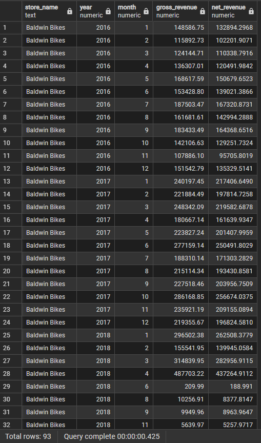
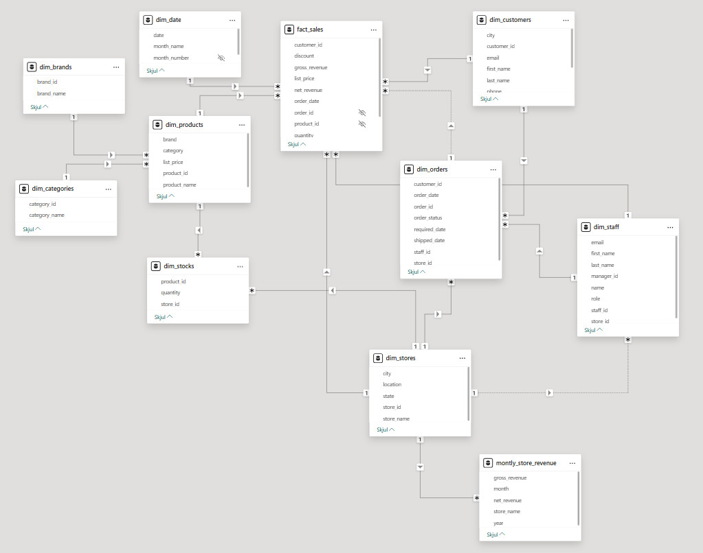
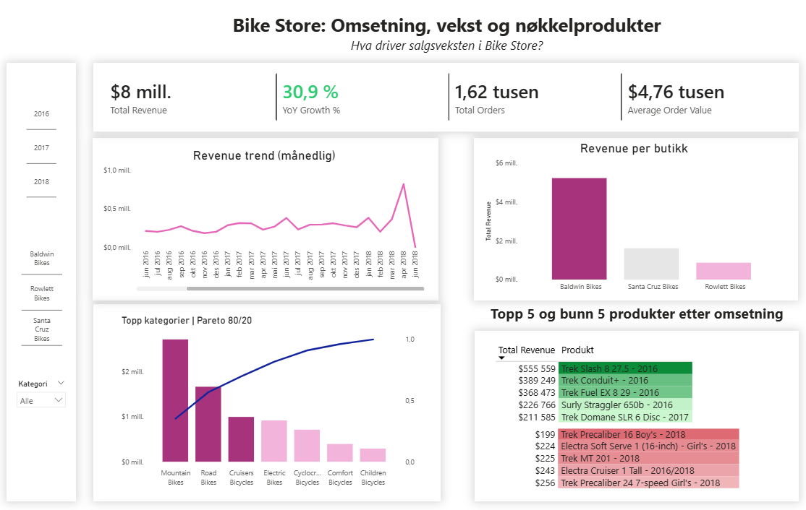

Denne delen dokumenterer hvordan rådata er kvalitetssikret og strukturert til et analyseklart datavarehus. All forretningslogikk er håndtert i SQL for å sikre konsistens, gjenbrukbarhet og en ryddig semantisk modell i Power BI.

# Data preparation \| SQL

### Datakvalitet & forståelse

Før modellering ble datasettet gjennomgått for å avdekke strukturelle og forretningsmessige avvik.

Fokuset var å sikre at nøkkelrelasjoner og verdier var konsistente og egnet for analyse.

-   Verifisering av radantall per tabell\
-   Kontroll av NULL-verdier i primær- og fremmednøkler\
-   Sjekk for duplikater\
-   Validering av relasjoner mellom ordre, produkter og butikker

### Bygge dimensjonstabeller

Dimensjonstabellene er bygget for å støtte et stjerneskjema, der hver dimensjon representerer én forretningsentitet med tydelig ansvar og lav redundans.

<details>

<summary>Dimensjonstabeller</summary>

``` sql
-- dim_products
SELECT p.product_id, 
        p.product_name, 
        c.category_name AS category, 
        b.brand_name AS brand, 
        p.list_price
FROM products p
    JOIN brands b USING (brand_id)
    JOIN categories c USING (category_id);


-- dim_stores
CREATE OR REPLACE VIEW dim_stores AS
SELECT 
    store_id,
    store_name, 
    city,
    state,
    CONCAT(city, ', ', state) AS location
FROM stores;

-- dim_staff
CREATE OR REPLACE VIEW dim_staff AS
SELECT 
    staff_id,
    first_name,
    last_name,
    staffs.email,
    store_id,
    manager_id,
    CONCAT(first_name, ' ', last_name) AS name,
    CASE
        WHEN manager_id IS NULL THEN 'Manager'
        ELSE 'Staff'
    END AS role
FROM staffs
    JOIN stores USING (store_id);

-- dim_customers
CREATE OR REPLACE VIEW dim_customers AS
SELECT 
    CONCAT(first_name, ' ', last_name) AS name,
    street,
    city,
    state,
    zip_code,
    CONCAT(state, '/', city)
FROM customers;

SELECT *
FROM order_items;
```

</details>

Faktatabellen samler alle salgsrelaterte hendelser på ordrenivå og inneholder både brutto- og nettoomsetning.

Dette muliggjør fleksibel analyse av volum, pris og rabatter i Power BI.

<details>

<summary>Faktatabell</summary>

``` sql
CREATE OR REPLACE VIEW fact_sales AS
SELECT 
  o.order_id,
  o.order_date,
  o.store_id,
  o.staff_id,
  o.customer_id,
  oi.product_id,
  oi.quantity,
  oi.list_price,
  oi.discount, 
  oi.quantity * oi.list_price AS gross_revenue,
  oi.quantity * oi.list_price * (1 - oi.discount) AS net_revenue
FROM orders o
JOIN order_items oi USING (order_id);
```

</details>

### Analyse-views (for aggregering og ytelse)

<details>

<summary>SQL analyser</summary>

``` sql
CREATE OR REPLACE VIEW vw_montly_store_revenue AS
SELECT 
    s.store_name,
    EXTRACT(YEAR FROM order_date) AS year,
    EXTRACT(MONTH FROM order_date) AS month,
    SUM(gross_revenue) AS gross_revenue,
    SUM(net_revenue) AS net_revenue
FROM fact_sales f
    LEFT JOIN dim_stores s
    ON f.store_id = s.store_id
GROUP BY store_name, year, month
ORDER BY store_name, year, month;
```

<summary>SQL output</summary>



</details>

# Data visualisering \| Power BI

SQL-modellen fungerer som et semantisk lag for Power BI.

All visualisering er bygget på views, ikke råtabeller, for å sikre korrekt logikk og ryddig modellering.

<details>

<summary>Datamodell</summary>



</details>

### Overview



Dashboardet viser at salgsveksten i Bike Store er sterk (+30,9 % YoY), men samtidig tydelig konsentrert.

En begrenset andel produkter og én hovedbutikk står for størstedelen av omsetningen, noe som indikerer både høy avhengighet og potensial for sortiments- og lageroptimalisering.

**Ønsker du å se mer detaljer eller diskutere analysen videre?**\
📧 [Send meg en e-post](mailto:larsmartin95@hotmail.com?subject=Henvendelse%20fra%20portef%C3%B8lje)

🔗 [LinkedIn](https://www.linkedin.com/in/lars-martin-tingelstad-657940113/)
