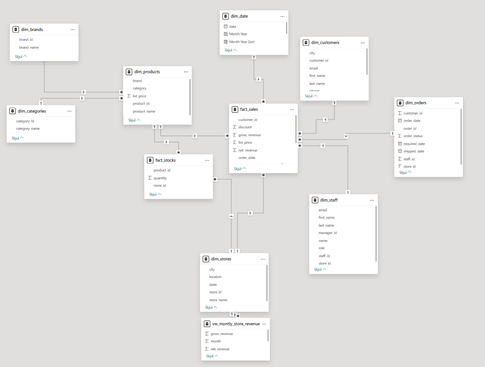
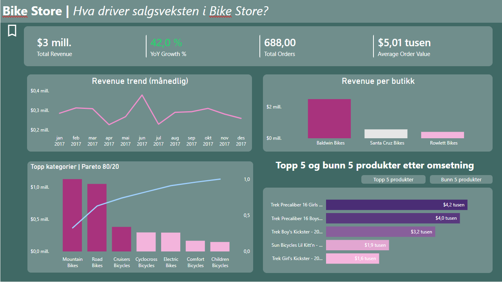

## Problemstilling

Ledelsen i Bike Store manglet oversikt over hva som faktisk driver salgsutviklingen.

Sentrale spørsmål var:

-   Hvilke produkter og kategorier driver omsetningen?
-   Hvordan utvikler salget seg over tid?
-   Hvor konsentrert er omsetningen på tvers av butikker og produkter?

Målet med analysen var å strukturere rådata til et analyseklart datagrunnlag og utvikle et dashboard som forklarer drivere bak omsetning og vekst.

---

## Executive summary

- Salgsanalysen viser sterk vekst (**+42 % YoY**), men omsetningen er konsentrert i et begrenset antall produkter og butikker.
- Datamodellen ble strukturert som et stjerneskjema i SQL og brukt som semantisk lag for Power BI.
- Dashboardet gjør det mulig å identifisere drivere bak salgsvekst og gir grunnlag for beslutninger knyttet til sortiment, lager og salg.

---

## Analyseprosess

Prosjektet ble gjennomført i tre steg:

1.  Datarydding og strukturering i SQL\
2.  Datamodellering (stjerneskjema)\
3.  Analyse og visualisering i Power BI

Pipeline:

**Rådata → SQL datamodell → Power BI analyse → beslutningsstøtte**

---

# Data preparation \| SQL

### Datakvalitet og struktur

Før modellering ble datasettet gjennomgått for å sikre konsistent datagrunnlag.

Kontroller inkluderte:

-   verifisering av radantall per tabell\
-   kontroll av NULL-verdier i primær- og fremmednøkler\
-   identifisering av duplikater\
-   validering av relasjoner mellom ordre, produkter og butikker

Dette sikrer at analysene i Power BI bygger på konsistente og pålitelige data.

---

### Datamodellering – dimensjonstabeller

Datastrukturen ble modellert som et **stjerneskjema**, der dimensjonstabeller beskriver forretningsentiteter og faktatabellen inneholder transaksjoner.

<details>

<summary>Dimensjonstabeller</summary>

``` sql
-- dim_products
SELECT p.product_id, 
        p.product_name, 
        c.category_name AS category, 
        b.brand_name AS brand, 
        p.list_price
FROM products p
    JOIN brands b USING (brand_id)
    JOIN categories c USING (category_id);


-- dim_stores
CREATE OR REPLACE VIEW dim_stores AS
SELECT 
    store_id,
    store_name, 
    city,
    state,
    CONCAT(city, ', ', state) AS location
FROM stores;

-- dim_staff
CREATE OR REPLACE VIEW dim_staff AS
SELECT 
    staff_id,
    first_name,
    last_name,
    staffs.email,
    store_id,
    manager_id,
    CONCAT(first_name, ' ', last_name) AS name,
    CASE
        WHEN manager_id IS NULL THEN 'Manager'
        ELSE 'Staff'
    END AS role
FROM staffs
    JOIN stores USING (store_id);

-- dim_customers
CREATE OR REPLACE VIEW dim_customers AS
SELECT 
    CONCAT(first_name, ' ', last_name) AS name,
    street,
    city,
    state,
    zip_code,
    CONCAT(state, '/', city)
FROM customers;

SELECT *
FROM order_items;
```

</details>

Faktatabellen samler alle salgsrelaterte hendelser på ordrenivå og inneholder både brutto- og nettoomsetning.

Dette muliggjør fleksibel analyse av volum, pris og rabatter i Power BI.

<details>

<summary>Faktatabell</summary>

``` sql
CREATE OR REPLACE VIEW fact_sales AS
SELECT 
  o.order_id,
  o.order_date,
  o.store_id,
  o.staff_id,
  o.customer_id,
  oi.product_id,
  oi.quantity,
  oi.list_price,
  oi.discount, 
  oi.quantity * oi.list_price AS gross_revenue,
  oi.quantity * oi.list_price * (1 - oi.discount) AS net_revenue
FROM orders o
JOIN order_items oi USING (order_id);
```

</details>

**Analyse-views**. For å forenkle analyse i Power BI ble aggregerte views opprettet i SQL.

<details>

<summary>SQL analyser</summary>

``` sql
CREATE OR REPLACE VIEW vw_montly_store_revenue AS
SELECT 
    s.store_name,
    EXTRACT(YEAR FROM order_date) AS year,
    EXTRACT(MONTH FROM order_date) AS month,
    SUM(gross_revenue) AS gross_revenue,
    SUM(net_revenue) AS net_revenue
FROM fact_sales f
    LEFT JOIN dim_stores s
    ON f.store_id = s.store_id
GROUP BY store_name, year, month
ORDER BY store_name, year, month;
```

<summary>SQL output</summary>


</details>

---

# Data visualisering \| Power BI

SQL-modellen fungerer som et semantisk lag for Power BI.

<details>

<summary>Datamodell</summary>



</details>

---

## Dashboard – oversikt over salgsutvikling

{fig-align="center"}

Dashboardet er designet for å gi en rask oversikt over:

- utvikling i omsetning over tid  
- hvilke produkter og kategorier som driver salget  
- hvordan omsetningen fordeler seg mellom butikker  

Visualiseringen gjør det mulig å identifisere både vekstmønstre og konsentrasjon i salget.

---

## Hvordan dashboardet brukes

Dashboardet er strukturert rundt tre analyser:

**1. Salgsutvikling over tid**

Visualiserer månedlig utvikling i omsetning og gjør det mulig å identifisere sesongmønstre og vekstperioder.

**2. Produkt- og kategorianalyse**

Viser hvilke produkter og kategorier som står for størstedelen av omsetningen.

Dette gjør det mulig å identifisere:

- topprodukter  
- konsentrasjonsrisiko  
- potensial for sortimentsoptimalisering  

**3. Butikkanalyse**

Sammenligner omsetning mellom butikker for å identifisere geografiske forskjeller i salgsytelse.

---

## Innsikt fra analysen

Analysen viser at salgsveksten i Bike Store er sterk (**+42 % YoY**), men samtidig tydelig konsentrert.

Viktige funn:

- en liten andel produkter driver en stor del av omsetningen  
- én hovedbutikk står for en betydelig andel av salget  
- veksten er i stor grad volumdrevet  

Dette indikerer både høy avhengighet av enkelte produkter og potensial for optimalisering av sortiment og lagerstrategi.

## Hva denne casen demonstrerer

-   SQL datamodellering

-   Design av stjerneskjema

-   Datarydding og kvalitetssikring

-   KPI-design i Power BI

-   Analyse av forretningsdrivere

-   Visualisering av innsikt for beslutningsstøtte
