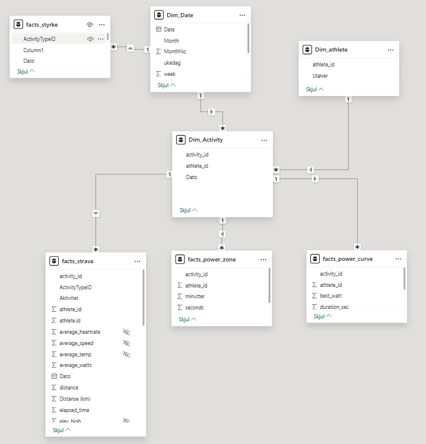
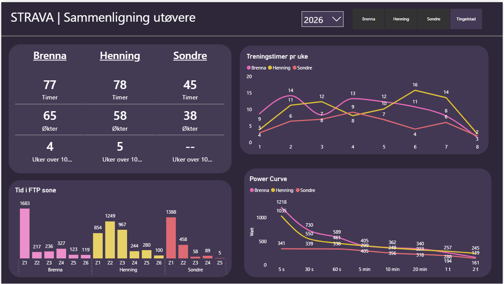
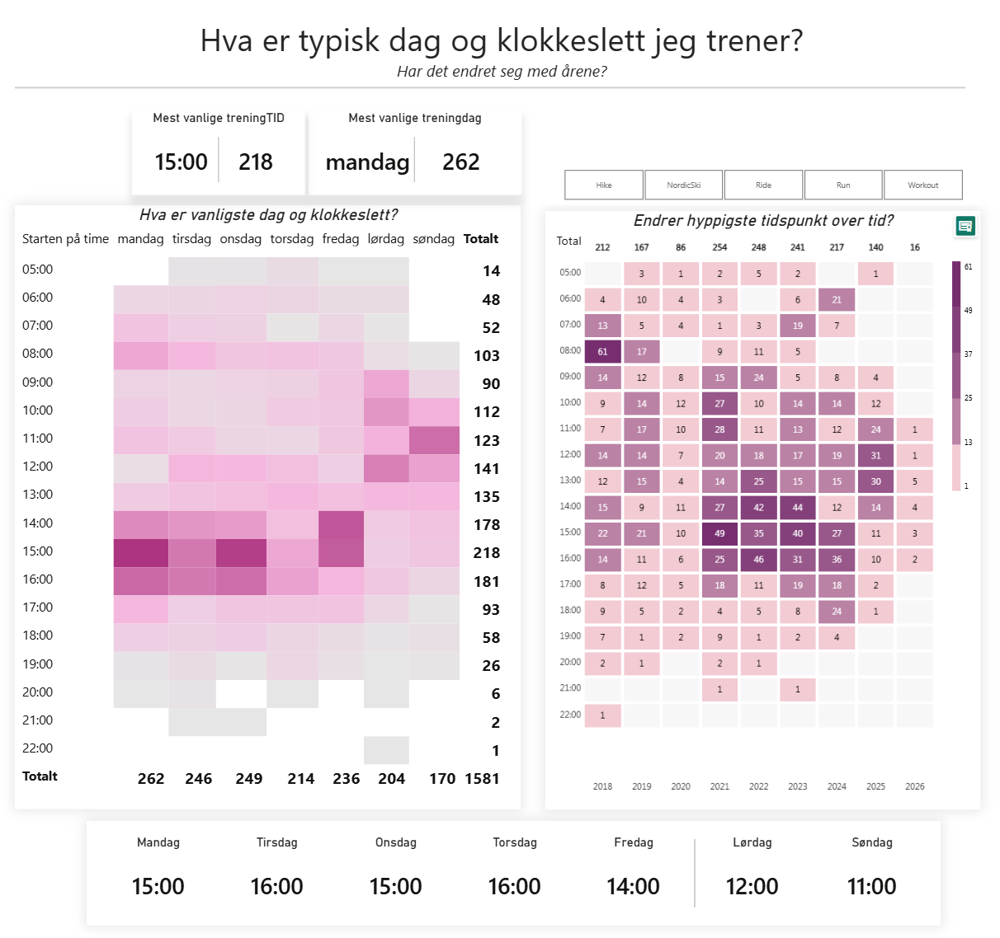
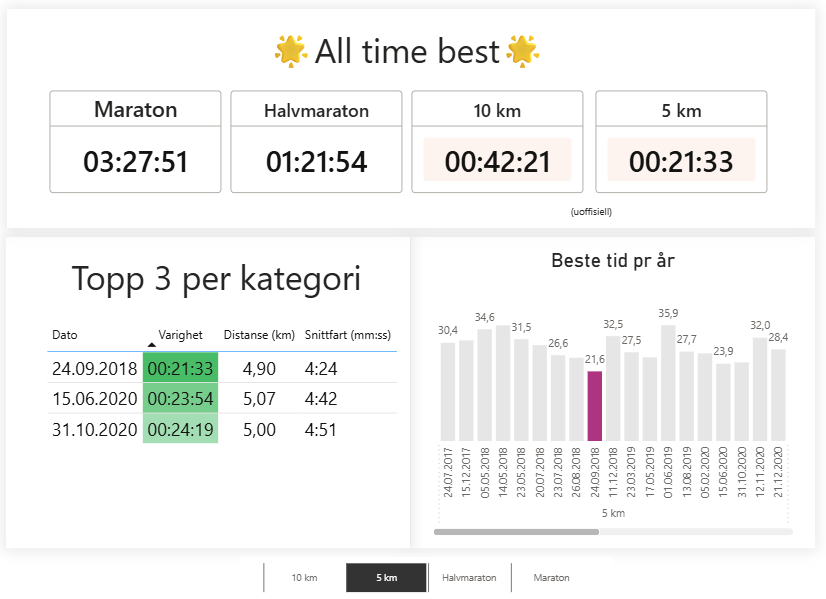
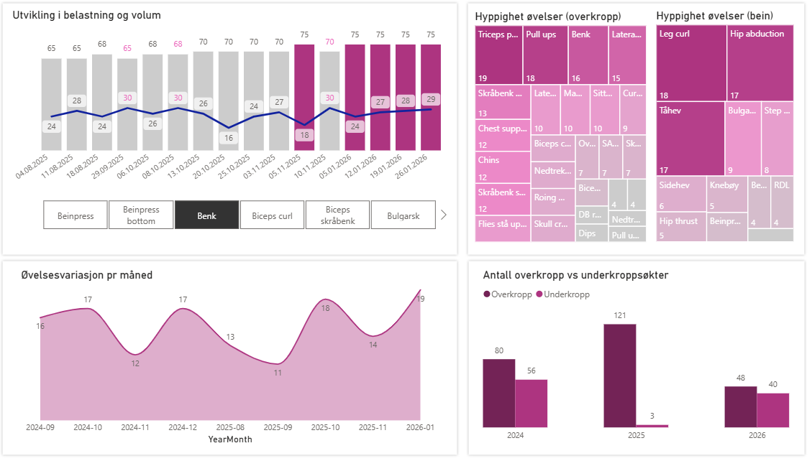
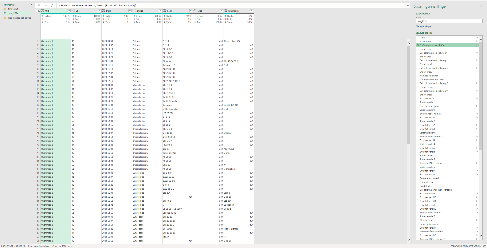
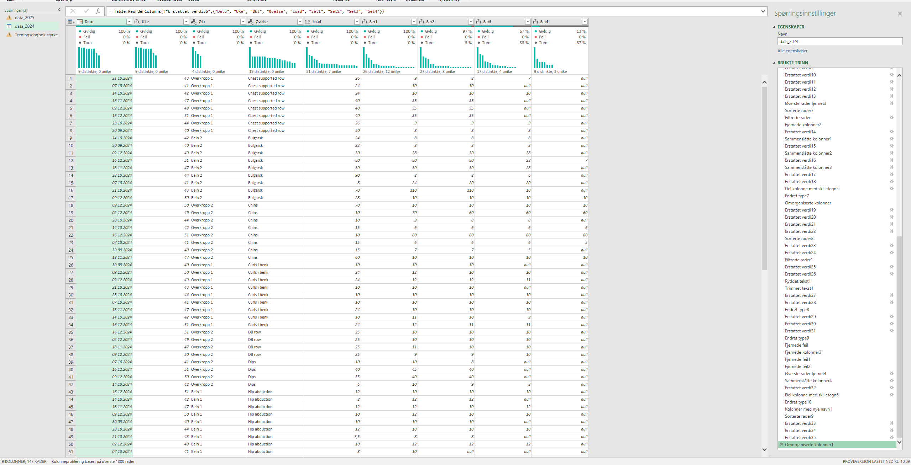

Dette prosjektet bruker treningsdata fra Strava og egen treningsdagbok for å analysere treningsbelastning, utvikling over tid og mønstre i treningspreferanser. Formålet er å demonstrere ferdigheter innen datainnhenting, datamodellering og visualisering i Power BI.

-   Bygget en automatisert pipeline (Strava API → R → PostgreSQL → Power BI)

<!-- -->

-   Modellert stjerneskjema med fakta- og dimensjonstabeller

-   Utviklet DAX-mål for trend, PB, preferanse- og prestasjonsanalyse

-   Resultat: Interaktive dashboards for belastning, prestasjon og treningsmønster

## Datakilder

-   Strava API (aktivitetsdata)
    -   Metadata: type økt, varighet, distanse, hastighet, tid mm.
-   Treningsdagbok styrketrening
    -   Metadata: dato, belastning, volum, øvelse

## Datainnhenting

-   OAuth-autentisering
-   Henting av aktiviteter via API
-   Periodisk refresh
-   *... data fra andre venner*

## Datamodellering

-   Faktatabell: aktiviteter fra strava og treningsdagbok styrke
-   Datodimensjon
-   Aktivitetstype



## Analyse og innsikt

### Dashboard utøver


Dette dashboardet muliggjør direkte sammenligning av treningsmengde, intensitetsfordeling og prestasjon mellom utøvere innen valgt år. Målet er å identifisere forskjeller i treningsprofil og fysisk kapasitet.

### 📊 Treningsvolum

Lik totalmengde betyr ikke lik belastningsprofil. Konsistens over uker er en viktigere indikator på robusthet enn enkelttopper.

### 📈 Treningsmønster per uke

Stabil progresjon kan indikere bedre periodisering. Store topper kan gi rask fremgang – men også økt skaderisiko.

### ⚡ Power Curve

Utøverne har ulike fysiologiske profiler. Dashboardet synliggjør styrker og svakheter på tvers av energisystemer.

### Sammenligning utøver



Individuell oversikt over treningsutvikling, aktivitetsfordeling og prestasjon – med fokus på progresjon og belastningskontroll.

### Treningspreferanser



En tydelig preferanse mot å trene på ettermiddag, etter jobb, men tidligere på formiddagen i helg. Stabil døgnpreferanse over flere år, med midlertidig forskyvning mot morgenøkter i 2018.

### Beste prestasjoner



### Treningsvolum over tid


I 2025 var det en særlig nedgang på slutten av året.

### Oversikt over styrkeøkter

{.lightbox}

-   **Øverst til venstre**: Jevn økning i benkpress med liten endring i total volum pr økt

-   **Øverst til venstre**: Triceps, pull ups og benk de mest vanlige øvelsene for overkropp, mens leg curl, hip abduction og tåhev for underkropp (preget av kneproblematikk siste årene)

-   **Nederst til venstre**: Variasjon i unike øvelser per måned siste året. Ok variasjon her.

-   **Nederst til høyre**: Andel overkropp vs underkropp. Never skip leg day, heh.

## Data­rydding og modellering (Power BI)

### Utgangspunkt (rådata)

Rådata bestod av:

-   Strava-aktiviteter

-   Treningsdagbok i bredt format (kolonner med uke, belastning og reps, økt + øvelse i rader)

    -   Inkonsekvente øktnavn og øvelesesnavn, bredt format som ikke kunne analyseres, reps/load i samme celle

### Ryddetrinn (Power Query)

Dataryddingen ble gjort fullt ut i **Power Query**, med fokus på reproduserbarhet.

**Hovedsteg:**

1.  Standardiserte kolonnenavn og datatyper

2.  Splittet og normaliserte treningsdagbok (bred → lang)

3.  Renset øktnavn og samlet varianter (UB1, Upper body, Overkropp → Overkropp)

<details>

<summary>Ryddetrinn (Power Query): Kroppsdel</summary>

``` dax
Kroppsdel =
  VAR x = UPPER ( 'facts_styrke'[Økt] )
  RETURN
  SWITCH (
    TRUE (),
    CONTAINSSTRING(x, "UB") || CONTAINSSTRING (x, "UPPER") || CONTAINSSTRING (x,          "OVER"),
    "Overkropp",
    CONTAINSSTRING (x, "LB" ) || CONTAINSSTRING (x, "BEIN" ) || CONTAINSSTRING (x,        "LOWER") || CONTAINSSTRING (x, "REHAB"),
    "Underkropp",
    "Ukjent"
)
```

</details>

4.  Fjernet tomme og ugyldige rader

5.  Kombinerte årstabeller til én faktatabell

### Etter (modellklar struktur)

Resultatet er:

-   Én konsistent **faktatabell for styrketrening**

-   Separate dimensjoner for dato og aktivitet

-   Klar separasjon mellom over- og underkropp

-   Datagrunnlag egnet for DAX og tidsserieanalyse

#### Eksempler (Power Query)

<details>

<summary>Strava-data</summary>

{fig-width="50%"}

</details>

<details>

<summary>Styrkefil 2024 \| Før rydding</summary>



</details>

<details>

<summary>Styrkefil 2024 \| Etter rydding</summary>



</details>

### DAX-mål (eksempler)

<details>

<summary>Session LY</summary>

``` dax
Sessions LY =
CALCULATE (
    [Sessions],
    SAMEPERIODLASTYEAR ( 'Dim_date'[Date] )
) 
```

</details>

<details>

<summary>Most Frequent Training Day</summary>

``` dax
Most Frequent Training Day = 
VAR DayCounts =
    SUMMARIZE(
        'Dim_Date',
        'Dim_Date'[ukedag],
        "Sessions", CALCULATE(COUNT('facts_strava'[type]))
    )
VAR TopDay =
    TOPN(1, DayCounts, [Sessions], DESC)
RETURN
    MAXX(TopDay, 'Dim_Date'[ukedag])
```

</details>

<details>

<summary>Personal best (duration)</summary>

``` dax
PB Duration (sec) = 
CALCULATE(
    MIN('facts_strava'[moving_time]),
    FILTER(
        ALL('facts_strava'),
        'facts_strava'[Run Distance Category]
            = SELECTEDVALUE('facts_strava'[Run Distance Category])
        && 'facts_strava'[type] = "Run"
    )
)
```

</details>

<details>

<summary>Topp 3 løp</summary>

``` dax
Pallen = 
VAR ThisTime =
    SELECTEDVALUE('facts_strava'[moving_time])
RETURN
RANKX(
    ALLSELECTED('facts_strava'),
    'facts_strava'[moving_time],
    ThisTime,
    ASC,
    DENSE
)
```

</details>

## Datainnhenting – Strava API (R)

Strava-data ble hentet via **Strava REST API**, autentisert med OAuth 2.0.

Løsningen er bygget i R og lagrer data direkte i **PostgreSQL** for videre bruk i Power BI.

### 1️⃣ Autentisering (OAuth)

Tilgangstoken hentes via Strava sin OAuth-flyt.\
*Sensitiv informasjon håndteres via miljøvariabler.*

<details>

<summary>R – Autentisering mot Strava API</summary>

```         
library(httr) 
library(jsonlite)  

res <- POST("https://www.strava.com/oauth/token",   
        body = list(client_id = Sys.getenv("STRAVA_CLIENT_ID"), 
        client_secret = Sys.getenv("STRAVA_CLIENT_SECRET"),
        code = Sys.getenv("STRAVA_AUTH_CODE"),
        grant_type = "authorization_code"),
        encode = "form")
        
tokens <- content(res, "parsed") access_token <- tokens$access_token 
```

</details>

### 2️⃣ Henting av aktivitetsdata (paginert)

Alle aktiviteter hentes sidevis (200 per kall) til alle sider er lest.

<details>

<summary>R – Nedlasting av Strava-aktiviteter</summary>

```         
library(dplyr)  

get_activities <- function(page, token) {   
  GET("https://www.strava.com/api/v3/athlete/activities",
  query = list(per_page = 200, page = page), 
  add_headers(Authorization = paste("Bearer", token))
  ) 
  }  
  
all_activities <- list() 
page <- 1  

repeat {
  res  <- get_activities(page, access_token)
  data <- fromJSON(content(res, "text"), flatten = TRUE) 
  
  if (nrow(data) == 0) break  
  
  all_activities[[page]] <- data   
  page <- page + 1 
}  

activities <- bind_rows(all_activities) 
```

</details>

### 3️⃣ Klargjøring av data (API → analyse)

Nested JSON-felter flates ut og reduseres til analyse­relevante kolonner.

<details>

<summary>R – Klargjøring av aktivitetsdata</summary>

```         
activities_sql <- activities %>%   select(
  activity_id = id,
  name,
  type,
  start_date,
  distance,
  moving_time,
  elapsed_time,
  total_elevation_gain,
  average_speed,
  max_speed,
  average_watts,
  max_watts,
  average_heartrate,
  max_heartrate,
  location_city,
  location_country,
  athlete.id
  ) 
```

</details>

### 4️⃣ Lagring i PostgreSQL

Data lagres i en dedikert database for videre bruk i Power BI.

<details>

<summary>R – Lagring i PostgreSQL</summary>

```         
library(DBI) 
library(RPostgres)

con <- dbConnect(
  Postgres(),
  dbname = "strava",
  host = "xxx",
  port = xxx,
  user = Sys.getenv("PG_USER"),
  password = Sys.getenv("PG_PASSWORD")
  )  
  
dbWriteTable(
  con,
  name = Id(schema = "public", table = "activities"),
  value = activities_sql,
  overwrite = TRUE
) 
```

</details>

### Full refresh alle utøvere

<details>

<summary>R – Full refresh nye økter/utøvere</summary>

```         
update_all_athletes <- function() {
  
  library(httr)
  library(jsonlite)
  library(dplyr)
  library(DBI)
  library(RPostgres)
  
  con <- dbConnect(
    RPostgres::Postgres(),
    dbname   = "strava",
    host     = "localhost",
    port     = xxx,
    user     = "xxx",
    password = "xxx"
  )
  
  athletes <- dbGetQuery(
    con,
    "SELECT athlete_id, refresh_token FROM public.strava_tokens"
  )
  
  if (nrow(athletes) == 0) {
    message("Ingen registrerte utøvere.")
    dbDisconnect(con)
    return(invisible(NULL))
  }
  
  for (i in seq_len(nrow(athletes))) {
    
    athlete_id    <- as.numeric(athletes$athlete_id[i])
    refresh_token <- athletes$refresh_token[i]
    
    cat("\n--- Starter bruker:", athlete_id, "---\n")
    
    # ---- Refresh token ----
    res_token <- POST(
      "https://www.strava.com/oauth/token",
      body = list(
        client_id     = "xxx",
        client_secret = "xxx",
        refresh_token = refresh_token,
        grant_type    = "refresh_token"
      ),
      encode = "form"
    )
    
    if (status_code(res_token) != 200) {
      message("Refresh feilet for ", athlete_id)
      next
    }
    
    access_token <- content(res_token, "parsed")$access_token
    
    # ---- Finn siste aktivitet ----
    last_date <- dbGetQuery(
      con,
      paste0(
        "SELECT MAX(start_date)
         FROM public.activities
         WHERE athlete_id = ", athlete_id
      )
    )[[1]]
    
    after_ts <- if (is.na(last_date)) {
      0
    } else {
      as.integer(as.POSIXct(last_date, tz = "UTC")) - 3600
    }
    
    # ---- Hent nye aktiviteter ----
    all_activities <- list()
    page <- 1
    
    repeat {
      
      res <- GET(
        "https://www.strava.com/api/v3/athlete/activities",
        query = list(
          per_page = 200,
          page = page,
          after = after_ts
        ),
        add_headers(Authorization = paste("Bearer", access_token))
      )
      
      if (status_code(res) != 200) break
      
      data <- fromJSON(content(res, "text"), flatten = TRUE)
      
      if (length(data) == 0) break
      
      all_activities[[page]] <- data
      page <- page + 1
      
      Sys.sleep(1)
    }
    
    if (length(all_activities) == 0) {
      message("Ingen nye økter for ", athlete_id)
      next
    }
    
    activities <- bind_rows(all_activities)
    
    # ---- Klargjør data ----
    activities_sql <- activities %>%
      rename(activity_id = id) %>%
      select(any_of(c(
        "activity_id",
        "name",
        "type",
        "start_date",
        "distance",
        "moving_time",
        "elapsed_time",
        "total_elevation_gain",
        "average_speed",
        "average_heartrate",
        "location_city",
        "location_state",
        "location_country",
        "max_speed",
        "average_watts",
        "max_watts",
        "elev_high",
        "elev_low",
        "has_kudoed",
        "max_heartrate"
      )))
      
      required_cols <- c(
        "activity_id","name","type","start_date","distance",
        "moving_time","elapsed_time","total_elevation_gain",
        "average_speed","average_heartrate",
        "location_city","location_state","location_country",
        "max_speed","average_watts","max_watts",
        "elev_high","elev_low","has_kudoed",
        "max_heartrate"
      )
    
    missing_cols <- setdiff(required_cols, names(activities_sql))
    
    if (length(missing_cols) > 0) {
      activities_sql[missing_cols] <- NA
    }
    
    activities_sql <- activities_sql %>%    
      mutate(
        athlete_id = athlete_id,
        distance = as.numeric(distance),
        moving_time = as.numeric(moving_time),
        elapsed_time = as.numeric(elapsed_time),
        total_elevation_gain = as.numeric(total_elevation_gain),
        average_speed = as.numeric(average_speed),
        max_speed = as.numeric(max_speed),
        average_heartrate = as.numeric(average_heartrate),
        max_heartrate = as.numeric(max_heartrate),
        average_watts = as.numeric(average_watts),
        max_watts = as.numeric(max_watts),
        elev_high = as.numeric(elev_high),
        elev_low = as.numeric(elev_low)
      )
    
    # ---- Midlertidig tabell ----
    dbWriteTable(
      con,
      "temp_activities",
      activities_sql,
      temporary = TRUE,
      overwrite = TRUE
    )
    
    # ---- Insert med ON CONFLICT ----
    dbExecute(
      con,
      "
      INSERT INTO public.activities (
        activity_id,
        name,
        type,
        start_date,
        distance,
        moving_time,
        elapsed_time,
        total_elevation_gain,
        average_speed,
        average_heartrate,
        location_city,
        location_state,
        location_country,
        max_speed,
        average_watts,
        max_watts,
        elev_high,
        elev_low,
        has_kudoed,
        max_heartrate,
        athlete_id
      )
      SELECT
        activity_id,
        name,
        type,
        start_date,
        distance,
        moving_time,
        elapsed_time,
        total_elevation_gain,
        average_speed,
        average_heartrate,
        location_city,
        location_state,
        location_country,
        max_speed,
        average_watts,
        max_watts,
        elev_high,
        elev_low,
        has_kudoed,
        max_heartrate,
        athlete_id
      FROM temp_activities
      ON CONFLICT (activity_id) DO NOTHING
      "
    )
    
    message("Ferdig med bruker ", athlete_id)
  }
  
  dbDisconnect(con)
  message("Oppdatering ferdig.")
}


update_all_athletes()
```

</details>

### 5️⃣ Verifisering

Enkel validering sikrer at data er korrekt lastet.

```         
SELECT COUNT(*) FROM public.activities;
```

## Begrensninger

-   Fravær av subjektive belastningsmål begrenser total belastningsmodellering (RPE, HRV)
-   Avhengig av Strava-datakvalitet
