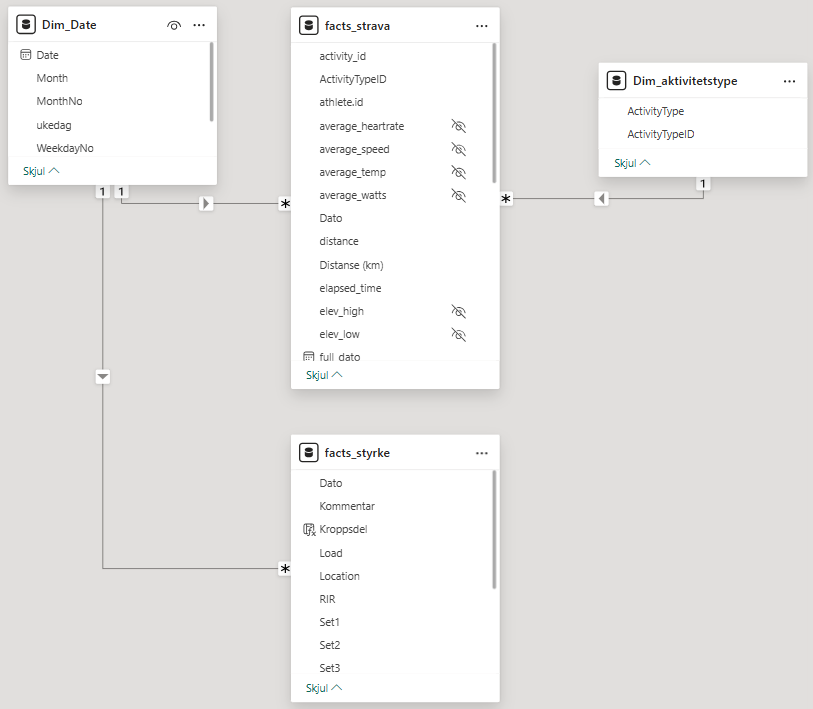

Dette prosjektet bruker egne treningsdata fra Strava for å analysere treningsbelastning, utvikling over tid og mønstre i treningspreferanser. Formålet er å demonstrere ferdigheter innen datainnhenting, datamodellering og visualisering i Power BI.

## Datakilder

-   Strava API (personlige aktivitetsdata)
    -   Metadata: type økt, varighet, distanse, hastighet, tid
-   Treningsdagbok styrketrening
    -   Metadata: dato, belastning, volum, øvelse

## Datainnhenting

-   OAuth-autentisering
-   Henting av aktiviteter via API
-   Periodisk refresh
-   *... data fra andre venner*

## Datamodellering

-   Faktatabell: aktiviteter fra strava og treningsdagbok styrke
-   Datodimensjon
-   Aktivitetstype



## Analyse og innsikt

### Treningspreferanser


En tydelig preferanse mot å trene på ettermiddag, etter jobb, men tidligere på formiddagen i helg. Ingen klar trend i endring med tiden, bortsett fra en preferanse for tidlig trening i 2018.

### Beste prestasjoner


### Treningsvolum over tid


En, dessverre nedgang i total treningstid siden 2021. Og enda verre for løping. Veldig godt år i 2019.


I 2025 var det en særlig nedgang på slutten av året.

### Oversikt over styrkeøkter


-   Øverst til venstre: Jevn økning i benkpress med liten endring i total volum pr økt

-   Øverst til venstre: Triceps, pull ups og benk de mest vanlige øvelsene for overkropp, mens leg curl, hip abduction og tåhev for underkropp (preget av kneproblematikk siste årene)

-   Nederst til venstre: Variasjon i unike øvelser per måned siste året. Ok variasjon her.

-   Nederst til høyre: Andel overkropp vs underkropp. Never skip leg day, heh.

## Data­rydding og modellering (Power BI)

### Utgangspunkt (rådata)

Rådata bestod av:

-   Strava-aktiviteter

-   Treningsdagbok i bredt format (kolonner med uke, belastning og reps, økt + øvelse i rader)

    -   Inkonsekvente øktnavn og øvelesesnavn, bredt format som ikke kunne analyseres, reps/load i samme celle

### Ryddetrinn (Power Query)

Dataryddingen ble gjort fullt ut i **Power Query**, med fokus på reproduserbarhet.

**Hovedsteg:**

1.  Standardiserte kolonnenavn og datatyper

2.  Splittet og normaliserte treningsdagbok (bred → lang)

3.  Renset øktnavn og samlet varianter (UB1, Upper body, Overkropp → Overkropp)

<details>

<summary>Ryddetrinn (Power Query): Kroppsdel</summary>

``` dax
Kroppsdel =
VAR x = UPPER ( 'facts_styrke'[Økt] )
RETURN
SWITCH (
    TRUE (),
    CONTAINSSTRING ( x, "UB" ) || CONTAINSSTRING ( x, "UPPER" ) || CONTAINSSTRING ( x, "OVER" ),
        "Overkropp",
    CONTAINSSTRING ( x, "LB" ) || CONTAINSSTRING ( x, "BEIN" ) || CONTAINSSTRING ( x, "LOWER" ) || CONTAINSSTRING ( x, "REHAB" ),
        "Underkropp",
    "Ukjent"
)
```

</details>

4.  Fjernet tomme og ugyldige rader

5.  Kombinerte årstabeller til én faktatabell

### Etter (modellklar struktur)

Resultatet er:

-   Én konsistent **faktatabell for styrketrening**

-   Separate dimensjoner for dato og aktivitet

-   Klar separasjon mellom over- og underkropp

-   Datagrunnlag egnet for DAX og tidsserieanalyse


### DAX-mål

<details>

<summary>DAX- Session LY</summary>

``` dax
Sessions LY =
CALCULATE (
    [Sessions],
    SAMEPERIODLASTYEAR ( 'Dim_date'[Date] )
) 
```

</details>

-   treningsvolum
-   rullerende gjennomsnitt
-   sesongaggregater
-   Interaktive slicere og drill-down

## Datainnhenting – Strava API (R)

Strava-data ble hentet via **Strava REST API**, autentisert med OAuth 2.0.

Løsningen er bygget i R og lagrer data direkte i **PostgreSQL** for videre bruk i Power BI.

### 1️⃣ Autentisering (OAuth)

Tilgangstoken hentes via Strava sin OAuth-flyt.\
*Sensitiv informasjon håndteres via miljøvariabler.*

<details>

<summary>R – Autentisering mot Strava API</summary>

```         
library(httr) 
library(jsonlite)  

res <- POST("https://www.strava.com/oauth/token",   
        body = list(client_id = Sys.getenv("STRAVA_CLIENT_ID"), 
        client_secret = Sys.getenv("STRAVA_CLIENT_SECRET"),
        code = Sys.getenv("STRAVA_AUTH_CODE"),
        grant_type = "authorization_code"),
        encode = "form")
        
tokens <- content(res, "parsed") access_token <- tokens$access_token 
```

</details>

### 2️⃣ Henting av aktivitetsdata (paginert)

Alle aktiviteter hentes sidevis (200 per kall) til alle sider er lest.

<details>

<summary>R – Nedlasting av Strava-aktiviteter</summary>

```         
library(dplyr)  

get_activities <- function(page, token) {   
  GET("https://www.strava.com/api/v3/athlete/activities",
  query = list(per_page = 200, page = page), 
  add_headers(Authorization = paste("Bearer", token))
  ) 
  }  
  
all_activities <- list() 
page <- 1  

repeat {
  res  <- get_activities(page, access_token)
  data <- fromJSON(content(res, "text"), flatten = TRUE) 
  
  if (nrow(data) == 0) break  
  
  all_activities[[page]] <- data   
  page <- page + 1 
}  

activities <- bind_rows(all_activities) 
```

</details>

### 3️⃣ Klargjøring av data (API → analyse)

Nested JSON-felter flates ut og reduseres til analyse­relevante kolonner.

<details>

<summary>R – Klargjøring av aktivitetsdata</summary>

```         
activities_sql <- activities %>%   select(
  activity_id = id,
  name,
  type,
  start_date,
  distance,
  moving_time,
  elapsed_time,
  total_elevation_gain,
  average_speed,
  max_speed,
  average_watts,
  max_watts,
  average_heartrate,
  max_heartrate,
  location_city,
  location_country,
  athlete.id
  ) 
```

</details>

### 4️⃣ Lagring i PostgreSQL

Data lagres i en dedikert database for videre bruk i Power BI.

<details>

<summary>R – Lagring i PostgreSQL</summary>

```         
library(DBI) 
library(RPostgres)

con <- dbConnect(
  Postgres(),
  dbname = "strava",
  host = "localhost",
  port = 5432,
  user = Sys.getenv("PG_USER"),
  password = Sys.getenv("PG_PASSWORD")
  )  
  
dbWriteTable(
  con,
  name = Id(schema = "public", table = "activities"),
  value = activities_sql,
  overwrite = TRUE
) 
```

</details>

### 5️⃣ Verifisering

Enkel validering sikrer at data er korrekt lastet.

```         
SELECT COUNT(*) FROM public.activities;
```

## Begrensninger

-   Kun egne data (ikke generaliserbart)
-   Mangler eksterne belastningsmål (RPE, HRV)
-   Avhengig av Strava-datakvalitet

## Videre arbeid

-   Kombinere med subjektive data
-   Automatisert refresh
-   Prediktive modeller for belastning
