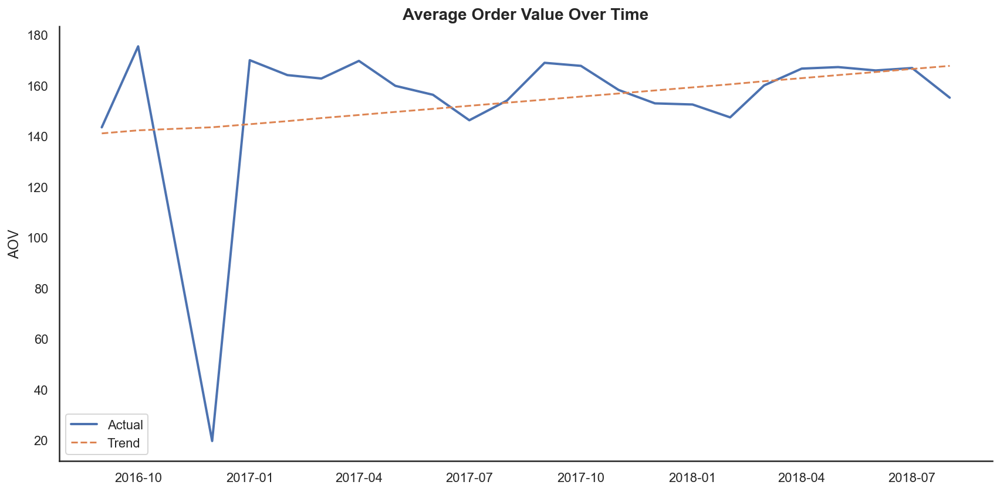
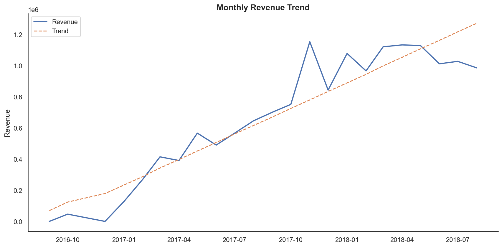
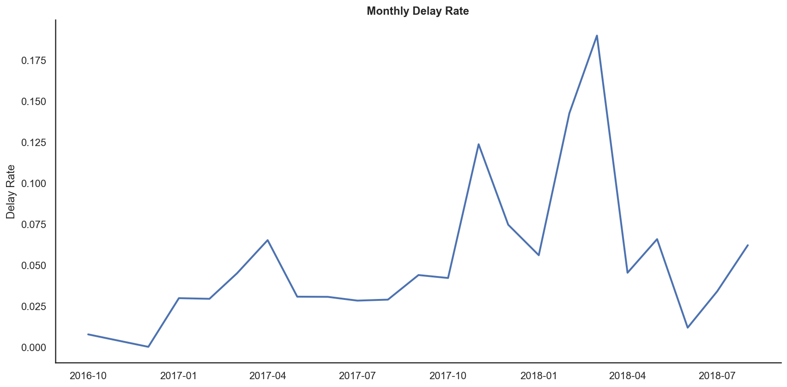
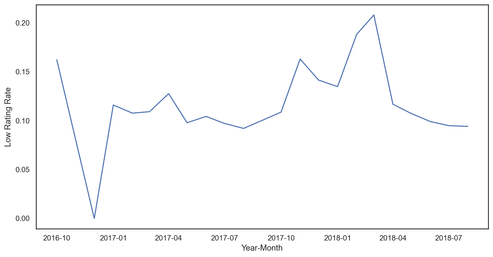
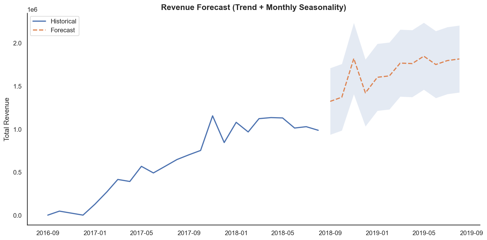

```{=html}
<!-- HERO BANNER -->
<div class="project-hero">
  <div class="hero-eyebrow">Kommersielt analyseprosjekt</div>
  <h1 class="hero-title">Fra rådata til<br><em>beslutningsgrunnlag</em></h1>
  <p class="hero-sub">Analyse av ~100 000 ordre i den brasilianske e-commerce plattformen Olist — med fokus på leveringsprestasjon, omsetningsprognoser og operasjonell risiko.</p>

  <div class="tag-row">
    <span class="ptag sql">PostgreSQL</span>
    <span class="ptag python">Python</span>
    <span class="ptag python">Statsmodels</span>
    <span class="ptag python">Pandas</span>
    <span class="ptag bi">Power BI</span>
    <span class="ptag">Logistisk regresjon</span>
    <span class="ptag">Tidsserieanalyse</span>
    <span class="ptag">Scenarioanalyse</span>
    <span class="ptag">Feature Engineering</span>
  </div>
</div>

<!-- STATS BAR -->
<div class="stats-bar">
  <div class="stat-item">
    <div class="stat-num">~100<span class="stat-accent">k</span></div>
    <div class="stat-label">Ordre analysert</div>
  </div>
  <div class="stat-item">
    <div class="stat-num">9<span class="stat-accent">→</span>59<span class="stat-accent">%</span></div>
    <div class="stat-label">Økt risiko ved forsinkelse</div>
  </div>
  <div class="stat-item">
    <div class="stat-num">54<span class="stat-accent">k</span></div>
    <div class="stat-label">Estimert månedlig vekst</div>
  </div>
  <div class="stat-item">
    <div class="stat-num">95<span class="stat-accent">%</span></div>
    <div class="stat-label">Forklart variasjon (R²)</div>
  </div>
</div>
```

## Executive Summary

Dette prosjektet analyserer kommersiell ytelse i den brasilianske e-commerce plattformen **Olist**. Målet er å identifisere hvilke faktorer som påvirker **kundetilfredshet, omsetning og operasjonell risiko**, og oversette analysen til konkrete forretningsanbefalinger.

Analysen kombinerer SQL-datamodellering, statistisk modellering i Python, tidsserieanalyse og scenarioanalyse.

::: callout-important
## Nøkkelfunn

Leveringsforsinkelser er den **enkelt sterkeste prediktoren for lav kundevurdering** — og en faktor operasjonell ledelse direkte kan påvirke. En forsinket ordre øker sannsynligheten for lav rating fra **9 % til 59 %**.
:::

```{=html}
<div class="findings-grid">
  <div class="finding-card">
    <div class="finding-idx">Funn 01</div>
    <div class="finding-headline">Forsinkelse nær seksdobler risikoen</div>
    <div class="finding-body">En forsinket ordre øker sannsynligheten for lav kundevurdering fra 9 % til 59 % — en effekt som holder seg stabil på tvers av produktkategorier og ordreverdier.</div>
    <span class="finding-metric">+50pp</span>
  </div>
  <div class="finding-card">
    <div class="finding-idx">Funn 02</div>
    <div class="finding-headline">Stabil omsetningsvekst med R² på 95 %</div>
    <div class="finding-body">Trendmodell med sesong estimerer en månedlig økning på ~54 000. Modellen forklarer nær all historisk variasjon og gir et solid grunnlag for budsjettplanlegging.</div>
    <span class="finding-metric">+54k/mnd</span>
  </div>
  <div class="finding-card">
    <div class="finding-idx">Funn 03</div>
    <div class="finding-headline">5 % reduksjon = 322 færre forsinkelser</div>
    <div class="finding-body">Scenarioanalysen viser at selv marginale forbedringer i logistikk gir direkte, målbar effekt på kundeopplevelse og fraktkostnad.</div>
    <span class="finding-metric">322 ordre</span>
  </div>
</div>
```

------------------------------------------------------------------------

## Forretningskontekst

Olist er en brasiliansk markedsplass som kobler selgere og kunder via én felles plattform. Selskapet opplever varierende leveringsprestasjon, stigende ordrevolum og usikkerhet rundt fremtidig omsetning.

**Beslutningsspørsmål:** Hva driver kundetilfredshet, og hva kan ledelsen gjøre med det?

Datasettet inneholder omtrent **100 000 ordre** med informasjon om ordre, produkter, betalinger, anmeldelser og leveringsdatoer.

------------------------------------------------------------------------

## Data og datamodell

Databasen ble strukturert som en **stjernemodell** i PostgreSQL — med en sentral faktatabell omgitt av dimensjonstabeller. Dette muliggjorde effektive joins på tvers av ordre, kunder, produkter og geografi.

```{=html}
<div class="schema-wrap">
  <div class="schema-dims">
    <div class="schema-label">Dimensjonstabeller</div>
    <div class="schema-tbl">
      <div class="stbl-name">dim_customers</div>
      <div class="stbl-fields">customer_id PK · customer_unique_id · customer_state</div>
    </div>
    <div class="schema-tbl">
      <div class="stbl-name">dim_products</div>
      <div class="stbl-fields">product_id PK · product_category_name · product_weight_g</div>
    </div>
    <div class="schema-tbl">
      <div class="stbl-name">dim_sellers</div>
      <div class="stbl-fields">seller_id PK · seller_city · seller_state</div>
    </div>
    <div class="schema-tbl">
      <div class="stbl-name">dim_category</div>
      <div class="stbl-fields">category_macro · 8 makrokategorier</div>
    </div>
    <div class="schema-tbl">
      <div class="stbl-name">vw_reviews_clean</div>
      <div class="stbl-fields">DISTINCT ON review_id · 814 duplikater håndtert</div>
    </div>
  </div>

  <div class="schema-fact">
    <div class="fact-label">⚡ Faktatabell</div>
    <div class="fact-name">fact_orders_v5</div>
    <div class="fact-fields">
      order_id PK<br>
      customer_id FK<br>
      total_order_value<br>
      delivery_time_days<br>
      delay_days · delay_flag<br>
      avg_review_score<br>
      low_rating_flag<br>
      repeat_customer_flag<br>
      category_macro<br>
      order_month
    </div>
  </div>
</div>
```

### PostgreSQL — Faktatabell med feature engineering

Rådata fra åtte tabeller ble transformert til én analyseklar faktatabell gjennom iterative CTE-baserte builds. Under er kjernetransformasjonen:

``` sql
-- Aggreger order_items til ordre-nivå og beregn forsinkelse
CREATE TABLE fact_orders_v3 AS
WITH order_items_agg AS (
    SELECT
        order_id,
        SUM(price)        AS total_price,
        SUM(freight_value) AS total_freight,
        COUNT(order_item_id) AS item_count
    FROM dim_order_items
    GROUP BY order_id
),

reviews_agg AS (
    SELECT order_id,
           AVG(review_score) AS avg_review_score
    FROM vw_reviews_clean        -- deduped view (814 duplikater fjernet)
    GROUP BY order_id
)

SELECT *,
    total_price + total_freight                               AS total_order_value,
    (order_delivered_customer_date::date
        - order_purchase_timestamp::date)                     AS delivery_time_days,
    (order_delivered_customer_date::date
        - order_estimated_delivery_date::date)                AS delay_days,
    (order_delivered_customer_date::date
        > order_estimated_delivery_date::date)::int           AS delay_flag
FROM fact_orders_v2
WHERE order_status = 'delivered'
  AND order_delivered_customer_date >= order_purchase_timestamp;
```

### PostgreSQL — Feature engineering

``` sql
-- Atferdsvariabler og rating-flagg
CREATE TABLE fact_orders_v4 AS
SELECT *,
    CASE WHEN avg_review_score <= 2 THEN 1 ELSE 0 END AS low_rating_flag,
    CASE WHEN avg_review_score >= 4 THEN 1 ELSE 0 END AS high_rating_flag,
    CASE WHEN customer_order_number > 1 THEN 1 ELSE 0 END AS repeat_customer_flag,
    EXTRACT(month FROM order_purchase_timestamp)       AS order_month
FROM (
    SELECT *,
        ROW_NUMBER() OVER (
            PARTITION BY customer_id
            ORDER BY order_purchase_timestamp
        ) AS customer_order_number   -- Ordrenummer i rekken per kunde
    FROM fact_orders_v3
) sub;
```

### PostgreSQL — Makrokategorier

``` sql
-- Aggreger 70+ kategorier til 8 meningsfulle makrogrupper
CREATE TABLE dim_category AS
SELECT
    product_category_name,
    product_category_name_english,
    CASE
        WHEN product_category_name_english IN (
            'computers','computers_accessories','electronics',
            'telephony','tablets_printing_image','consoles_games',
            'audio','fixed_telephony'
        ) THEN 'electronics_tech'

        WHEN product_category_name_english IN (
            'fashion_male_clothing','fashion_female_clothing',
            'fashion_shoes','fashion_bags_accessories',
            'watches_gifts'
        ) THEN 'fashion'

        WHEN product_category_name_english IN (
            'furniture_decor','furniture_living_room',
            'housewares','home_appliances','bed_bath_table'
        ) THEN 'home_furniture'

        WHEN product_category_name_english IN (
            'health_beauty','perfumery','diapers_and_hygiene'
        ) THEN 'beauty_health'

        WHEN product_category_name_english IN (
            'sports_leisure','toys','cool_stuff','musical_instruments'
        ) THEN 'sports_leisure'

        WHEN product_category_name_english IN (
            'books_general_interest','books_technical',
            'books_imported','dvds_blu_ray','music'
        ) THEN 'books_media'

        ELSE 'other'
    END AS category_macro
FROM dim_product_category;
```

------------------------------------------------------------------------

## Prediktiv analyse

### Logistisk regresjon: Forsinkelse → Lav kundevurdering

En logistisk regresjonsmodell ble brukt for å estimere sannsynligheten for lav kundevurdering (≤ 2 stjerner), med `delay_days`, `total_order_value` og `category_macro` som forklaringsvariabler.

``` python
import statsmodels.api as sm
import numpy as np

# Forklaringsvariabler
X = df[['delay_days', 'total_order_value']]
X = sm.add_constant(X)
y = df['low_rating_flag']

model_delay = sm.Logit(y, X).fit()
print(model_delay.summary())

# Odds ratios — effekt i multiplikator
np.exp(model_delay.params)

# Predikert sannsynlighet: 0, 5 og 10 dagers forsinkelse
new_data = pd.DataFrame({
    'delay_days': [0, 5, 10],
    'total_order_value': df['total_order_value'].mean()
})
new_data = sm.add_constant(new_data, has_constant='add')
pred = model_delay.predict(new_data)

# Resultat:
# P(lav rating | ingen forsinkelse)       ≈ 0.09
# P(lav rating | 10 dagers forsinkelse)   ≈ 0.59
```

::: callout-note
## Modelltolkning

`delay_days`-koeffisienten tilsvarer en **odds ratio på \~1.3 per dag** — altså øker oddsene for lav rating med \~30 % for hver dag over estimert leveringstid. Effekten er robust på tvers av produktkategorier og ordrestørrelser.
:::

### Modell med makrokategorier

``` python
# Modell inkludert kategori som forklaringsvariabel
X_macro = pd.get_dummies(
    df[['delay_flag', 'total_order_value', 'category_macro']],
    drop_first=True
)
X_macro = sm.add_constant(X_macro).astype(float)

model_macro = sm.Logit(y, X_macro).fit()
print(model_macro.summary())
np.exp(model_macro.params)
```

------------------------------------------------------------------------

## Tidsserieanalyse og prognose

### Operasjonelle KPIer over tid

``` python
import pandas as pd
import seaborn as sns
import matplotlib.pyplot as plt
import statsmodels.api as sm

sns.set_theme(style="white")
plt.rcParams["figure.figsize"] = (12, 6)

# Hent månedlige KPIer fra PostgreSQL
monthly_kpis = pd.read_sql(
    "SELECT * FROM public.monthly_kpis", engine
)

# AOV-trend
aov["time_index"] = range(len(aov))
X = sm.add_constant(aov["time_index"])
model = sm.OLS(aov["aov"], X).fit()
aov["trend"] = model.predict(X)
```









### Omsetningsprognose: Trend + sesong

``` python
# Trend + sesong (månedsdummyer)
monthly_kpis["time_index"] = range(1, len(monthly_kpis) + 1)
monthly_kpis["month"] = monthly_kpis["year_month"].dt.month.astype("category")

X = pd.get_dummies(
    monthly_kpis[["time_index", "month"]],
    drop_first=True, dtype=float
)
X = sm.add_constant(X)

model_trend_season = sm.OLS(
    monthly_kpis["total_revenue"], X
).fit()

print(f"R² = {model_trend_season.rsquared:.3f}")       # → 0.953
print(f"AIC trend-only:   {model_trend.aic:.1f}")
print(f"AIC trend+season: {model_trend_season.aic:.1f}")

# 12-måneders prognose med 95 % prediksjonsintervall
future_pred = model_trend_season.get_prediction(future_X)
future_ci   = future_pred.summary_frame(alpha=0.05)
```



::: callout-tip
## Modellvalg — AIC-sammenligning

Trend + sesong-modellen slår ren trendmodell på AIC, noe som bekrefter at sesongmønsteret er reelt og bør inkluderes i prognoser.
:::

------------------------------------------------------------------------

## Scenarioanalyse

Effekten av redusert leveringsforsinkelse ble simulert basert på observert fraktkostnadsdifferanse mellom forsinkede og ikke-forsinkede ordre (≈ 2,63 enheter per ordre).

``` python
baseline_delay_rate = fact_orders["delay_flag"].mean()
total_orders        = len(fact_orders)
extra_cost_per_delay = freight_delay - freight_no_delay  # ≈ 2.63

scenarios = [0.02, 0.05, 0.08]
results   = []

for reduction in scenarios:
    new_delay_rate  = baseline_delay_rate * (1 - reduction)
    avoided_delays  = total_orders * (baseline_delay_rate - new_delay_rate)
    cost_savings    = avoided_delays * extra_cost_per_delay

    results.append({
        "Reduksjon %":               reduction * 100,
        "Unngåtte forsinkede ordre": round(avoided_delays),
        "Fraktkostnadsbesparelse":   round(cost_savings)
    })

scenario_table = pd.DataFrame(results)
```

```{=html}
<table class="scenario-tbl">
  <thead>
    <tr>
      <th>Reduksjon i forsinkelser</th>
      <th>Unngåtte forsinkede ordre</th>
      <th>Kostnadsbesparelse</th>
      <th>Relativ effekt</th>
    </tr>
  </thead>
  <tbody>
    <tr>
      <td>2 %</td>
      <td>129</td>
      <td>339</td>
      <td><div class="sbar-wrap"><div class="sbar" style="width:64px;background:var(--p-accent)"></div><span>Lav</span></div></td>
    </tr>
    <tr>
      <td>5 %</td>
      <td>322</td>
      <td>847</td>
      <td><div class="sbar-wrap"><div class="sbar" style="width:128px;background:var(--p-blue)"></div><span>Moderat</span></div></td>
    </tr>
    <tr>
      <td>8 %</td>
      <td>515</td>
      <td>1 355</td>
      <td><div class="sbar-wrap"><div class="sbar" style="width:192px;background:#16a34a"></div><span>Høy</span></div></td>
    </tr>
  </tbody>
</table>
```

------------------------------------------------------------------------

## Anbefalinger

```{=html}
<div class="rec-grid">
  <div class="rec-card">
    <div class="rec-icon">🚚</div>
    <div>
      <div class="rec-title">Prioriter leveringspresisjon operasjonelt</div>
      <div class="rec-body">Forsinkelser er den klart sterkeste driveren for lav kundevurdering. Selv 5 % reduksjon forhindrer over 300 negative kundeopplevelser — og bør være første prioritet.</div>
    </div>
  </div>
  <div class="rec-card">
    <div class="rec-icon">📊</div>
    <div>
      <div class="rec-title">Implementer løpende KPI-overvåkning</div>
      <div class="rec-body">Månedlig delay rate, low rating rate og omsetning bør visualiseres i Power BI slik at avvik identifiseres raskt — ikke i etterkant.</div>
    </div>
  </div>
  <div class="rec-card">
    <div class="rec-icon">🎯</div>
    <div>
      <div class="rec-title">Kategorisegmentering for risikovurdering</div>
      <div class="rec-body">Noen produktkategorier viser systematisk høyere forsinkelsesrate. En kategori-spesifikk analyse kan identifisere hvilke selgere og ruter som driver mesteparten av problemene.</div>
    </div>
  </div>
  <div class="rec-card">
    <div class="rec-icon">📈</div>
    <div>
      <div class="rec-title">Bruk prognosemodellen aktivt i budsjett</div>
      <div class="rec-body">OLS-modellen med trend og sesong forklarer 95 % av omsetningsvariasjon og gir solide 12-måneders prognoser med konfidensintervall — et direkte styringsverktøy for CFO.</div>
    </div>
  </div>
</div>
```

------------------------------------------------------------------------

## Begrensninger

::: callout-warning
## Metoderefleksjon

-   Analysen er begrenset til perioden **2016–2018**
-   Manglende kostnadsdata gjør full marginanalyse vanskelig
-   Kundelojalitet ble modellert som binær flagg — mer granulær CLV-analyse ville vært neste steg
-   Ekstern validering av prognosen er ikke gjennomført
:::

------------------------------------------------------------------------

## Teknologi

```{=html}
<div class="tech-row">
  <div class="tech-pill"><span>🐘</span> PostgreSQL</div>
  <div class="tech-pill"><span>🐍</span> Python</div>
  <div class="tech-pill"><span>📦</span> Pandas</div>
  <div class="tech-pill"><span>📐</span> Statsmodels</div>
  <div class="tech-pill"><span>📊</span> Matplotlib · Seaborn</div>
</div>
```
