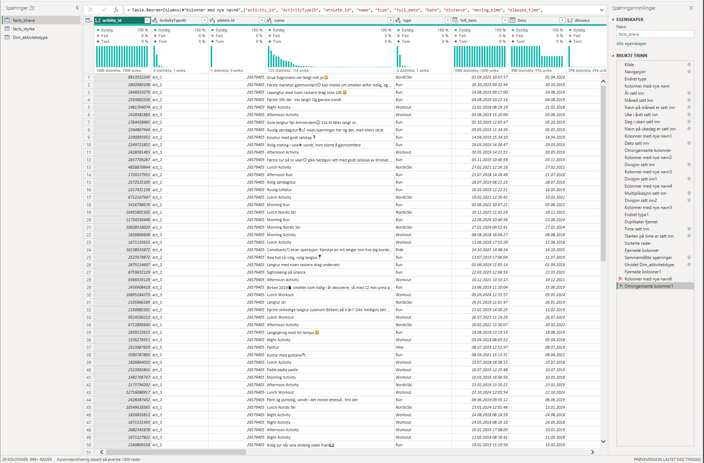
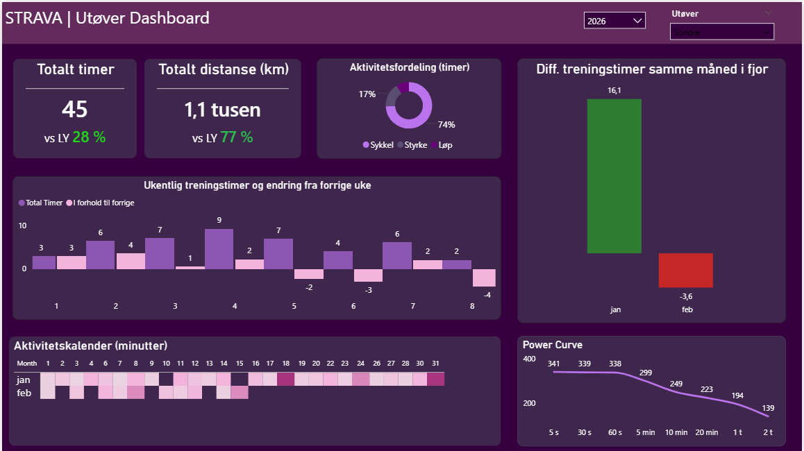
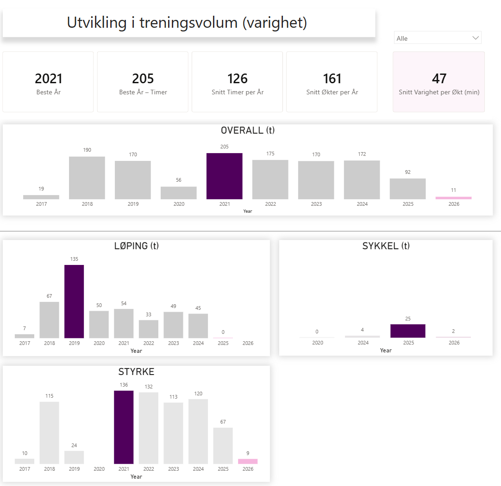

```{=html}
<div class="project-hero">
  <div class="hero-eyebrow">End-to-end datapipeline · Treningsanalyse</div>
  <h1 class="hero-title">Strava Analytics:<br><em>Fra API til innsikt</em></h1>
  <p class="hero-sub">En automatisert datapipeline som henter treningsdata fra Strava API, lagrer det i PostgreSQL og analyserer treningsbelastning, prestasjon og treningsmønster i Power BI.</p>
  <div class="tag-row">
    <span class="ptag python">R</span>
    <span class="ptag sql">PostgreSQL</span>
    <span class="ptag bi">Power BI</span>
    <span class="ptag bi">DAX</span>
    <span class="ptag">API-integrasjon</span>
    <span class="ptag">OAuth</span>
    <span class="ptag">Stjernemodell</span>
    <span class="ptag">Tidsserieanalyse</span>
  </div>
</div>

<div class="stats-bar">
  <div class="stat-item">
    <div class="stat-num">4 <span class="stat-accent">steg</span></div>
    <div class="stat-label">API → R → SQL → BI</div>
  </div>
  <div class="stat-item">
    <div class="stat-num">2</div>
    <div class="stat-label">Datakilder integrert</div>
  </div>
  <div class="stat-item">
    <div class="stat-num">★</div>
    <div class="stat-label">Stjerneskjema</div>
  </div>
  <div class="stat-item">
    <div class="stat-num">∞</div>
    <div class="stat-label">Automatisert innhenting</div>
  </div>
</div>
```

## Problemstilling

Treningsdata fra apper og manuelle logger lagres i separate systemer og i ulike formater. Dette gjør det vanskelig å analysere treningsbelastning, utvikling over tid og prestasjonsmønstre på tvers av aktivitetstyper og perioder.

::: callout-important
## Prosjektmål

Bygge en automatisert end-to-end pipeline som henter aktivitetsdata fra Strava API, strukturerer det i en analyseklar database, og visualiserer treningsinnsikt i Power BI — uten manuelle eksporttrinn.
:::

```{=html}
<div class="findings-grid">
  <div class="finding-card">
    <div class="finding-idx">Funn 01</div>
    <div class="finding-headline">Stabilitet er viktigere enn toppuker</div>
    <div class="finding-body">Stabil treningsmengde over tid er en bedre indikator på robusthet enn enkeltuker med høyt volum. Periodene med lavere aktivitet følger tydelige sesongmønstre.</div>
    <span class="finding-metric" style="color:var(--p-blue)">Stabilitet</span>
  </div>
  <div class="finding-card">
    <div class="finding-idx">Funn 02</div>
    <div class="finding-headline">Tydelig døgnrytme i treningstid</div>
    <div class="finding-body">Klar preferanse for trening på ettermiddag etter arbeidstid på hverdager, med tidligere øktstart i helgene. Mønsteret er konsistent på tvers av hele analyseperioden.</div>
  </div>
  <div class="finding-card">
    <div class="finding-idx">Funn 03</div>
    <div class="finding-headline">Overkropp dominerer styrketreningen</div>
    <div class="finding-body">Benkpress, pull ups og triceps utgjør majoriteten av styrkeøktene. Underkroppsøvelser er påvirket av tidligere kneproblematikk og er underrepresentert relativt til treningsvolum.</div>
  </div>
</div>
```

------------------------------------------------------------------------

## Pipeline-arkitektur

```{=html}
<div class="pipeline-row">
  <div class="pl-step"><div class="pl-icon">🔐</div><div class="pl-label">OAuth</div><div class="pl-sub">Strava API-autentisering</div></div>
  <div class="pl-arrow">→</div>
  <div class="pl-step"><div class="pl-icon">📥</div><div class="pl-label">Datainnhenting</div><div class="pl-sub">R · paginert API-kall</div></div>
  <div class="pl-arrow">→</div>
  <div class="pl-step"><div class="pl-icon">🗄️</div><div class="pl-label">PostgreSQL</div><div class="pl-sub">Lagring · stjerneskjema</div></div>
  <div class="pl-arrow">→</div>
  <div class="pl-step"><div class="pl-icon">📊</div><div class="pl-label">Power BI</div><div class="pl-sub">DAX · dashboards</div></div>
</div>
```

Data fra to kilder integreres i samme modell: Strava-aktiviteter (løp, sykkel, ski) og en manuell treningsdagbok for styrkeøkter. Stjerneskjemaet gjør det mulig å analysere begge på tvers av felles tidsdimensjon.

------------------------------------------------------------------------

## Datainnhenting — Strava API (R)

Strava-data hentes via REST API med OAuth 2.0-autentisering. Sensitiv informasjon håndteres via miljøvariabler — ingen credentials i koden.

### Autentisering (OAuth)

<details>

<summary>kode</summary>

``` r
library(httr)
library(jsonlite)

# Tilgangstoken via Strava OAuth-flyt
res <- POST("https://www.strava.com/oauth/token",
  body = list(
    client_id     = Sys.getenv("STRAVA_CLIENT_ID"),
    client_secret = Sys.getenv("STRAVA_CLIENT_SECRET"),
    code          = Sys.getenv("STRAVA_AUTH_CODE"),
    grant_type    = "authorization_code"
  ),
  encode = "form"
)

tokens       <- content(res, "parsed")
access_token <- tokens$access_token
```
</details>

### Paginert aktivitetshenting

API-et leverer maks 200 aktiviteter per side. Løkken henter alle sider automatisk til ingen flere resultater returneres.

<details>
<summary>kode</summary>
``` r
library(dplyr)

get_activities <- function(page, token) {
  GET(
    "https://www.strava.com/api/v3/athlete/activities",
    query = list(per_page = 200, page = page),
    add_headers(Authorization = paste("Bearer", token))
  )
}

all_activities <- list()
page <- 1

repeat {
  res  <- get_activities(page, access_token)
  data <- fromJSON(content(res, "text"), flatten = TRUE)

  if (nrow(data) == 0) break

  all_activities[[page]] <- data
  page <- page + 1
}

activities <- bind_rows(all_activities)
```
</details>

### Klargjøring og kolonnevalg

Nested JSON-felter flates ut, og datasettet reduseres til analyserelvante kolonner før lagring.

<details>
<summary>kode</summary>
``` r
activities_sql <- activities %>%
  select(
    activity_id          = id,
    name,
    type,
    start_date,
    distance,
    moving_time,
    elapsed_time,
    total_elevation_gain,
    average_speed,
    max_speed,
    average_watts,
    max_watts,
    average_heartrate,
    max_heartrate,
    location_city,
    location_country,
    athlete_id           = athlete.id
  )
```
</details>

### Lagring i PostgreSQL

<details>
<summary>kode</summary>
``` r
library(DBI)
library(RPostgres)

con <- dbConnect(
  Postgres(),
  dbname   = "strava",
  host     = Sys.getenv("PG_HOST"),
  port     = as.integer(Sys.getenv("PG_PORT")),
  user     = Sys.getenv("PG_USER"),
  password = Sys.getenv("PG_PASSWORD")
)

dbWriteTable(
  con,
  name  = Id(schema = "public", table = "activities"),
  value = activities_sql,
  overwrite = TRUE
)
```
</details>

Enkel validering etter lagring:

``` sql
SELECT COUNT(*) FROM public.activities;
```

------------------------------------------------------------------------

## Datamodell

Datasettet ble strukturert som et **stjerneskjema** med to faktatabeller — én for Strava-aktiviteter og én for styrkeøkter — koblet mot felles dato- og aktivitetsdimensjon.


------------------------------------------------------------------------

## Datarydding — Power Query

Treningsdagboken kom i bredt format med reps og belastning i samme celle. Ryddingen i Power Query fulgte fem trinn: standardisering av kolonnenavn og datatyper, transformasjon fra bredt til langt format, standardisering av øktnavn, fjerning av tomme rader og sammenslåing av årstabeller til én faktatabell.

::: {.callout-note collapse="true"}
## Styrkefil — før rydding


:::

::: {.callout-note collapse="true"}
## Styrkefil — etter rydding


:::

::: {.callout-note collapse="true"}
## Strava-data i Power Query


:::

### DAX — Kategorisering av kroppsdel

<details>
<summary>kode</summary>
``` dax
Kroppsdel =
VAR x = UPPER('facts_styrke'[Økt])
RETURN
SWITCH(
    TRUE(),
    CONTAINSSTRING(x, "UB") || CONTAINSSTRING(x, "UPPER") || CONTAINSSTRING(x, "OVER"),
    "Overkropp",
    CONTAINSSTRING(x, "LB") || CONTAINSSTRING(x, "BEIN") || CONTAINSSTRING(x, "LOWER") || CONTAINSSTRING(x, "REHAB"),
    "Underkropp",
    "Ukjent"
)
```
</details>
------------------------------------------------------------------------

## DAX-mål

De mest sentrale DAX-målene som ble bygget for analyse og dashboards:

<details>
<summary>Tidsintelligens</summary>

``` dax
Sessions LY =
CALCULATE(
    [Sessions],
    SAMEPERIODLASTYEAR('Dim_date'[Date])
)
```
</details>

<details>
<summary>Mest aktive treningsdag</summary>

``` dax
Most Frequent Training Day =
VAR DayCounts =
    SUMMARIZE(
        'Dim_Date',
        'Dim_Date'[ukedag],
        "Sessions", CALCULATE(COUNT('facts_strava'[type]))
    )
VAR TopDay =
    TOPN(1, DayCounts, [Sessions], DESC)
RETURN
    MAXX(TopDay, 'Dim_Date'[ukedag])
```
</details>

<details>

<summary>Personal best løpetid</summary>

``` dax
PB Duration (sec) =
CALCULATE(
    MIN('facts_strava'[moving_time]),
    FILTER(
        ALL('facts_strava'),
        'facts_strava'[Run Distance Category]
            = SELECTEDVALUE('facts_strava'[Run Distance Category])
        && 'facts_strava'[type] = "Run"
    )
)
```
</details>

<details>
<summary>Pallen — topp 3 løp</summary>

``` dax
Pallen =
VAR ThisTime =
    SELECTEDVALUE('facts_strava'[moving_time])
RETURN
RANKX(
    ALLSELECTED('facts_strava'),
    'facts_strava'[moving_time],
    ThisTime,
    ASC,
    DENSE
)
```
<details>

------------------------------------------------------------------------

## Analyse og visualisering

### Utøver-dashboard



Dashboardet gir oversikt over treningsvolum over tid, intensitetsfordeling og prestasjonsutvikling — med mulighet for å filtrere på periode og aktivitetstype.

### Sammenligning av utøvere


Sammenligningsdashboardet gjør det mulig å analysere treningsvolum, intensitetsprofil og prestasjon på tvers av utøvere innen en valgt periode.

### Treningspreferanser


Analysen avdekker en tydelig preferanse for trening på ettermiddag etter arbeidstid på hverdager, med tidligere øktstart i helgene.

### Beste prestasjoner


### Treningsvolum over tid



Analysen viser perioder med stabil treningsmengde og enkelte faser med lavere aktivitetsnivå — korrelert med kjente belastningsperioder utenfor trening.

### Styrkedashboard


Styrkedashboardet viser jevn progresjon i benkpress over analyseperioden, dominans av overkroppsøvelser og underrepresentasjon av underkropp knyttet til tidligere kneproblematikk.

------------------------------------------------------------------------

## Teknologi

```{=html}
<div class="tech-row">
  <div class="tech-pill"><span>🐍</span> R · httr · jsonlite</div>
  <div class="tech-pill"><span>🐘</span> PostgreSQL · DBI</div>
  <div class="tech-pill"><span>💡</span> Power BI</div>
  <div class="tech-pill"><span>📐</span> DAX</div>
  <div class="tech-pill"><span>🔄</span> Power Query</div>
  <div class="tech-pill"><span>🔐</span> OAuth 2.0</div>
</div>
```

::: callout-warning
## Metoderefleksjon

Pulsdata er ikke tilgjengelig for alle aktiviteter, noe som begrenser intensitetsanalysen. Styrkedata er manuelt registrert og kan inneholde inkonsistenser i øvelsesnavn som ikke fanges opp av SWITCH-logikken. Automatisk re-autentisering ved token-utløp er ikke implementert i nåværende pipeline-versjon.
:::
